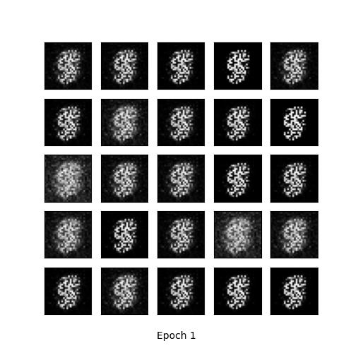
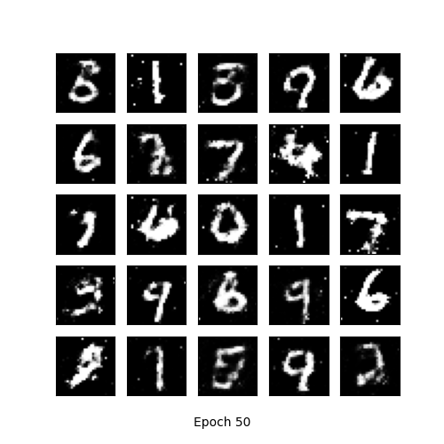
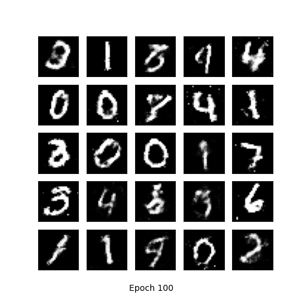
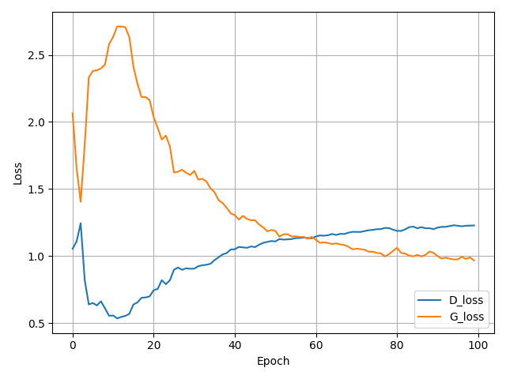

### README.md

# Simple GAN for MNIST

This repository contains a simple implementation of a Generative Adversarial Network (GAN) to generate MNIST-like handwritten digit images. The implementation is done using PyTorch.

## Introduction

Generative Adversarial Networks (GANs) are a type of artificial intelligence algorithm designed to create new data samples that resemble a given dataset. A GAN consists of two neural networks:

- **Generator**: Takes random noise as input and generates data samples (images in this case). Its goal is to produce realistic images that can fool the Discriminator.
- **Discriminator**: Takes data samples (either real from the dataset or fake from the Generator) and classifies them as real or fake. Its goal is to correctly identify which images are real and which are generated.

The two networks are trained simultaneously in a zero-sum game, where the Generator tries to minimize the Discriminator's ability to distinguish real from fake images, and the Discriminator tries to maximize its accuracy.

## Requirements

To install the required packages, run:

```bash
pip install -r requirements.txt
```

## Configuration

The configuration parameters for training can be set in the `config.yaml` file. Here is an example of the configuration file:

```yaml
training:
  batch_size: 128
  lr: 0.0002
  train_epoch: 100
  save_dir: 'MNIST_GAN_results'
  log_file: 'MNIST_GAN_results/training_log.txt'

data:
  dataset: 'MNIST'
  data_dir: 'data'
  image_size: 28
  num_channels: 1
  normalize_mean: 0.5
  normalize_std: 0.5

model:
  generator_input_size: 100
  generator_output_size: 784
  discriminator_input_size: 784
  discriminator_output_size: 1
```

## Training

To train the GAN, simply run:

```bash
python train.py
```

This will start the training process and save results and models in the directory specified in `config.yaml`.

## Results

### Generated Images

Below are examples of images generated by the GAN at different epochs of training:



*Generated Images at Epoch 1*



*Generated Images at Epoch 50*



*Generated Images at Epoch 100*

### Training Losses

The training losses for both the Discriminator and Generator are plotted and saved:



*Training Losses*

### Generation Animation

A GIF animation of the generated images over the training epochs is created:


*Generation Animation*

## File Structure

```
├── config.yaml
├── models
│   ├── __init__.py
│   ├── generator.py
│   └── discriminator.py
├── utils
│   ├── __init__.py
│   ├── training.py
│   └── visualization.py
├── train.py
├── requirements.txt
└── README.md
```

### File Explanations

- **config.yaml**: Configuration file for setting training and data parameters.
- **models/**
  - **generator.py**: Defines the Generator network.
  - **discriminator.py**: Defines the Discriminator network.
- **utils/**
  - **training.py**: Contains the training loop and functions.
  - **visualization.py**: Functions for visualizing results and saving images.
- **train.py**: Main script to start training.
- **requirements.txt**: List of required Python packages for the project.
- **README.md**: This file.

## Visualization Functions

- **show_result**: Generates and saves images produced by the Generator at different epochs.
- **show_train_hist**: Plots and saves the training losses of the Generator and Discriminator.

## Training Logs

Training logs are saved in the file specified by the `log_file` parameter in the `config.yaml`.

## How to Use

1. **Set up the environment**:
   ```bash
   pip install -r requirements.txt
   ```

2. **Configure training parameters** in `config.yaml`.

3. **Run the training**:
   ```bash
   python train.py
   ```

4. **Check results**: Generated images and training logs will be saved in the directory specified in `config.yaml`.

This setup will help you get started with training a GAN to generate MNIST-like images, providing a simple and clear structure for your project.
